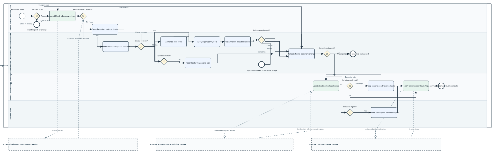

# Chemotherapy Cycle Review and Treatment Modification



## Group contribution and merge scope

This is JinWang's standalone contribution for the chemotherapy-cycle process. It is isolated under `contributions/chemotherapy-cycle-review/`; the repository's integrated model in `models/`, shared `forms/`, and shared `workers/` are unchanged. Review and merge this contribution separately. It is not yet integrated with the group's main process, so merging this branch will add the contribution folder without replacing the integrated model.

## Deliverables

- `chemotherapy-cycle-review-optimized.bpmn` — executable Camunda 8 BPMN with task-level operating steps and the full diagram layout.
- `chemotherapy-cycle-review-final.svg` — zoomable diagram rendered from the BPMN DI layout.
- `forms/` — nine linked Camunda Forms for the user tasks.
- `workers/chemotherapy-cycle-worker.mjs` — deterministic mock worker for results, schedule updates, and patient correspondence; it does not connect to hospital systems.
- `DEMO_RUN_GUIDE_zh.md` — Chinese demonstration instructions.
- `test_model.ps1` and `TEST_RESULTS.md` — repeatable static checks and recorded outcomes.
- `render_bpmn_svg.ps1` — regenerates the SVG from the BPMN file.

## Process safeguards

1. One start event routes recognised `cycleReview` and `treatmentModification` requests; an absent or unknown request type ends without changing the schedule.
2. Missing results keep the cycle pending and route to a controlled retry instead of clinical review or booking.
3. Clinical decisions, schedule updates, and Finance review are separate responsibilities.
4. An urgent postponement applies a safety hold first, then requires follow-up clinical authorisation. Cancellation or incomplete authorisation retains the hold and leaves the existing schedule unchanged.
5. A treatment schedule is updated only after the formal treatment change is authorised; unsuccessful scheduling stays pending for investigation.

## Local demonstration

Start a Camunda 8 environment reachable at `http://localhost:8080/v2` and deploy this BPMN with all nine forms. Open PowerShell in this contribution folder; if PowerShell starts at the repository root instead, first switch into the contribution folder:

```powershell
Set-Location .\contributions\chemotherapy-cycle-review # only when starting at the repository root
$env:CAMUNDA_API_URL = 'http://localhost:8080/v2'
$env:DEMO_RESULTS_AVAILABLE = 'true'
$env:DEMO_SCHEDULE_UPDATED = 'true'
$env:DEMO_NOTIFICATION_SENT = 'true'
node .\workers\chemotherapy-cycle-worker.mjs
```

Start the process in Tasklist with `requestType=cycleReview` for a cycle review or `requestType=treatmentModification` for a formal change request. Use the Chinese run guide for normal and exception demonstrations.

## Verification and known limits

The repeatable model-level suite reports 48 checks passed and 0 failed; Node.js syntax checking passed. The final BPMN was opened in Camunda Modeler 5.51.1 and its Problems panel reported 0 errors and 0 warnings. These checks do not establish live engine execution: the Camunda endpoints were not running during testing, so deployment and Tasklist end-to-end execution remain **待测试**. Worker responses are mocks, and real external service adapters and Tasklist role groups still require configuration.
